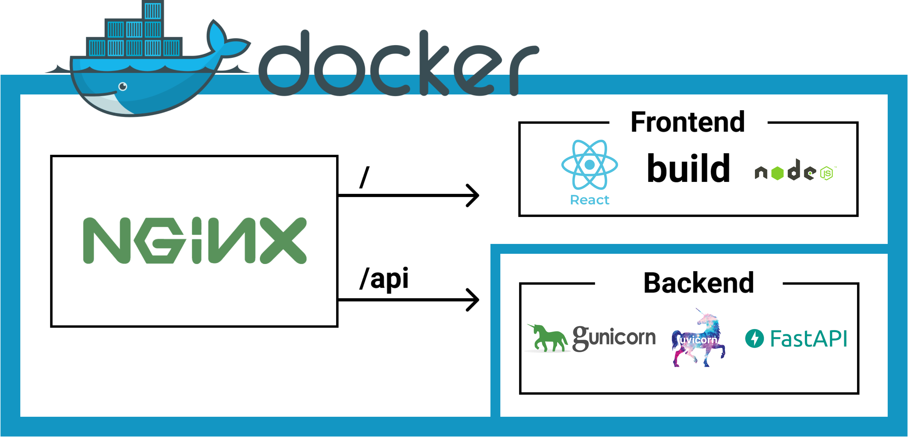

# SUTD HousingPortal


[](https://codecov.io/gh/MarkHershey/SUTDHousingPortal)

Focusing on transparent application process and easy-to-use UI, this is the proposed web-based Housing Portal MVP for SUTD.

## Stack



-   Backend
    -   [FastAPI](https://fastapi.tiangolo.com/) (Python high performance web framework)
    -   [Uvicorn](https://www.uvicorn.org/) (Python asynchronous ASGI server)
    -   [mongoDB](https://www.mongodb.com/)
-   Frontend
    -   [React](https://reactjs.org/)
    -   [Bootstrap](https://getbootstrap.com/)
-   Deployment
    -   [Gunicorn](https://gunicorn.org/) to spin up multiple Uvicorn workers
    -   [NGINX](https://www.nginx.com/) serve as reverse proxy server
    -   [Docker](https://www.docker.com/) containerize everything
-   Testing
    -   [pytest](https://docs.pytest.org/en/stable/)
    -   [selenium](https://selenium-python.readthedocs.io/)

## Development

### Dependencies

-   Backend development requires Linux/macOS as platform. ([Uvicorn](https://www.uvicorn.org/) depends on [uvloop](https://github.com/MagicStack/uvloop) which is not supported on Windows)
-   Python 3.6+

```bash
# At project root `YOUR/PATH/SUTDHousingPortal`
$ ./dev_setup.sh
```

### Run backend server locally

```bash
# At project root `YOUR/PATH/SUTDHousingPortal`
# activate python virtual environment
$ source venv/bin/activate
# run local server
$ uvicorn src.api.main:app --reload
```

Check API documentation after firing up local server

-   Go to [http://0.0.0.0/docs](http://0.0.0.0/docs)

### Run backend server locally with Docker

0. Install [**docker**](https://docs.docker.com/engine/install/) & [**docker-compose**](https://docs.docker.com/compose/install/).

1. Build
    ```bash
    docker-compose build
    ```
2. Run
    ```bash
    docker-compose up -d
    ```
3. Stop
    ```bash
    docker-compose down
    ```

### Run tests

```bash
# At project root `YOUR/PATH/SUTDHousingPortal`
$ pytest
```

## Developers

-   Huang He - [@MarkHershey](https://github.com/MarkHershey)
-   Wang Chenyu - [@JamesNolan17](https://github.com/JamesNolan17)
-   Justin Peng - [@Fattyboy9898](https://github.com/Fattyboy9898)
-   Ong Zhi Yi - [@gzyon](https://github.com/gzyon)

## Disclaimers

-   [MIT License](LICENSE) Copyright (c) 2021
-   This application is developed to fulfill the course requirement of SUTD 50.003 Elements of Software Construction (2021 Spring).

## Acknowledgement

-   Docker base images
    -   [tiangolo / uvicorn-gunicorn-fastapi-docker](https://github.com/tiangolo/uvicorn-gunicorn-fastapi-docker)
    -   [tiangolo / node-frontend](https://github.com/tiangolo/node-frontend)
