# 50.003 Elements of Software Construction - Final Project Report

- ISTD **Cohort 1 Group 9** - Self-initiated Project: A New SUTD Housing Portal
- Project Git Repository: [github.com/MarkHershey/SUTDHousingPortal](https://github.com/MarkHershey/SUTDHousingPortal)
- Live Application: [esc.dev.markhh.com](http://esc.dev.markhh.com/)
- API Documentation: [esc.dev.markhh.com/api/docs](http://esc.dev.markhh.com/api/docs)

| Student ID | Full Name   | Role                    |
| :--------: | :---------- | :---------------------- |
|  1004561   | Huang He    | Lead Backend Developer  |
|  1004515   | Wang Chenyu | Lead Frontend Developer |
|  1004234   | Justin Peng | Frontend Developer      |
|  1004664   | Ong Zhi Yi  | Backend Developer       |

---

## Table of Content

- [Use Case Diagram](#use-case-diagram)
- [System Design](#system-design)
  - [Class Diagram](#class-diagram)
  - [Sub-system Sequence Diagrams](#sub-system-sequence-diagrams)
    - [JWT Authentication](#key-sequence-jwt-authentication)
    - [Housing Application Exercise](#key-sequence-housing-application-exercise)
    - [Housing Events Management](#key-sequence-housing-events-management)
- [Implementation Challenges](#implementation-challenges)
  - [Engineering Challenges](#engineering-challenges)
    - [System Architecture Design](#System-Architecture-Design)
    - [Cloud-native & Container-based Deployment](#Cloud-native-&-Container-based-Deployment)
    - [User Access & Permissions](#User-Access-&-Permissions)
    - [Frontend Implementation Challenges](#Frontend-Implementation-Challenges)
  - [Testing Challenges](#testing-challenges)
    - [Auto-computation of Test Coverage](#Auto-computation-of-Test-Coverage)
    - [UI Testing Challenges](#UI-Testing-Challenges)
- [Testing](#testing)
  - [a. Unit Test](#a-unit-test)
  - [b. Integration Test](#b-integration-test)
  - [c. API-level User Flow Test](#c-api-level-user-flow-test)
  - [d. UI-level User Flow Test with Selenium](#d-ui-level-user-flow-test-with-selenium)
  - [e. UI Robustness Tests with Selenium](#d-ui-level-user-flow-test-with-selenium)
  - [f. User Test with End User](#f-user-test-with-end-user)
- [Lesson Learned](#lesson-learned)
- [Deliverables](#deliverables)
  - [Application Screenshots](#application-screenshots)
  - [API Endpoints](#api-endpoints)

---

## Use Case Diagram

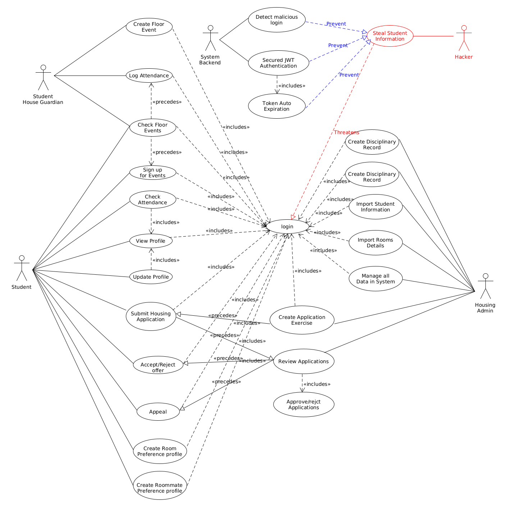

## System Design

### Class Diagram

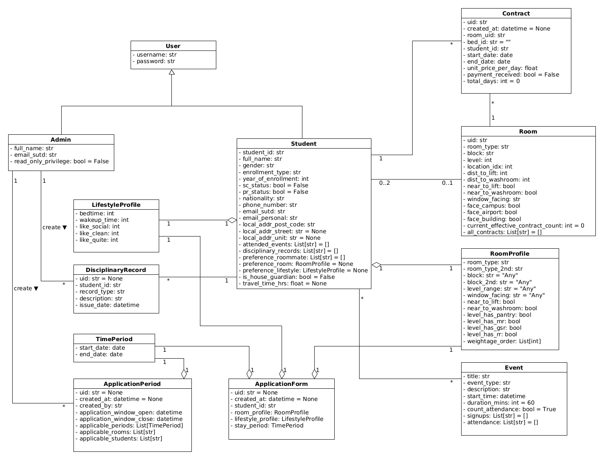

### Sub-system Sequence Diagrams

#### Key Sequence: JWT Authentication

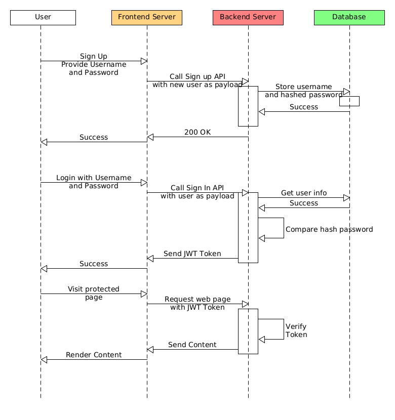

#### Key Sequence: Housing Application Exercise

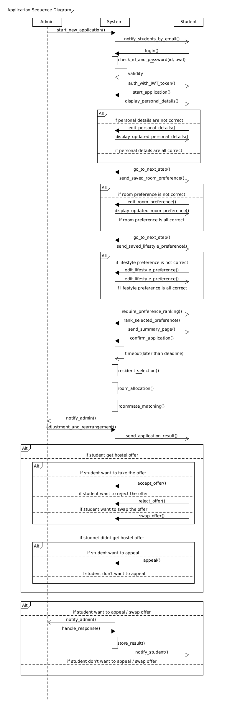

#### Key Sequence: Housing Events Management

## Implementation Challenges

### Engineering Challenges

#### System Architecture Design

From the start of the project, we want to build a high-performance web server that is able to support parallelism, but at the same time, ensure short development time because we adopted agile development working dynamics to roll out features fast and get feedbacks fast. Python is an good language for shortening development time, but it is an interpreted language that is limited by the GIL (Global Interpreter Lock). It is not efficient at runtime if we just use the traditional Python web frameworks such as [Flask](https://flask.palletsprojects.com/en/1.1.x/) or [Django](https://www.djangoproject.com/). After some research and experiment, we decided to use [FastAPI](https://fastapi.tiangolo.com/) as our backend framework and [Uvicorn](https://www.uvicorn.org/) as out ASGI (Asynchronous Server Gateway Interface) server. FastAPI supports asynchronous coroutines and it is tested to be 2 to 4 times faster than Django and Flask. For frontend, we have chosen the most popular frontend framework [React.js](https://reactjs.org/) based on [Node.js](https://nodejs.org/en/).

To facilitate the communications between frontend and backend, there are several options to setup the project. We decided to go for the relatively more independent frontend and backend setup, all communications are via RESTful API calls, and we uses [JWT](https://jwt.io/) (JSON Web Token) for user authentication and access control. Once the user is logged in, each subsequent HTTP request will include the JWT in the request header using the [Bearer](https://swagger.io/docs/specification/authentication/bearer-authentication/) schema, allowing the user to access routes, services, and resources that are permitted with that token.

We also uses [NGINX](https://www.nginx.com/) as a reverse proxy server to handle incoming requests, and direct requests either to static resources or the backend API port. At backend port, [Gunicorn](https://gunicorn.org/) serves as a master of `uvicorn.workers.UvicornWorker` and distribute the loads.

> JWT Authorization is implemented via a `AuthHandler` class, view source code [here](https://github.com/MarkHershey/SUTDHousingPortal/blob/master/src/api/auth.py).

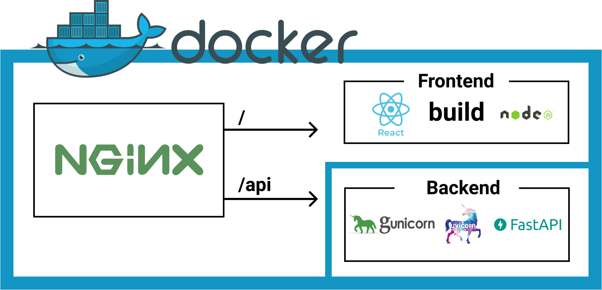

#### Cloud-native & Container-based Deployment

Most of the time, the usability and performance of a high-traffic website is not depend on what language or what framework the website is built on, but how the web server handles the request and distribute the load. For our application, a housing portal in education domain, the usage of the website is pretty low at normal time, but the usage will be extremely high during housing application period. The imbalance of load at different time brings us an engineering challenge, such that we need to fulfill the high-volume requests during short periods of time but still keep the server cost low on the long term. We believe the only solution is to make cloud-native application that is containerized such that a container instance can be easily duplicated and automatically scaled up and down based on the real-time server load. Hence, we decided to user [Docker](https://www.docker.com/) to containerize our application to be cloud ready.

Containerization also allow us to streamline the process of setting up development, staging, and production environments. With the help of container virtualization, we can ensure that our application is able to run at any machine, and the environment is 100% identical throughout development and production. To further simplify deployment process, we make use of [docker-compose](https://docs.docker.com/compose/) to configure environment variables, define the image building dependencies and sequences, set up inter-container networking, and container replication, restart policies, etc. A yaml file is used to set up everything once for all, enables single command tear down and re-deployment subsequently.

> View yaml configuration source file [here](https://github.com/MarkHershey/SUTDHousingPortal/blob/master/docker-compose.yml).

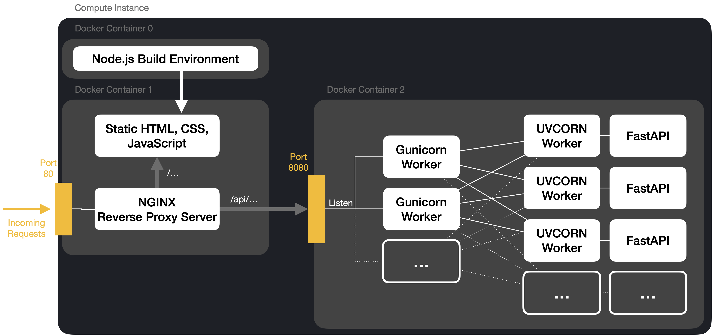

#### User Access & Permissions

The Housing portal is actually a data-intensive application with very low tolerance to data error and data confidentiality. Any compromises in data integrity and confidentiality will cause end-user to suffer significant confusions, inconveniences or even more serious consequences. Hence, a proper access control policy is essential and crucial. Some of the key requirements including but not limited to:

- Student identities, (such as student id, national ID number, enrollment information), need to be protected from leaking and false modification.
- System need to be separated into student-view and admin-view. Only admins are able to access certain functions such as room allocation, issuing of disciplinary records, etc.

Hence, we designed 4 types of users in our application and their corresponding access permissions as follows:

<table><thead><tr><th>Type</th><th>Sub-type</th><th>Level</th></tr></thead><tbody><tr><td rowspan="2">Admin</td><td>Admin</td><td>4</td></tr><tr><td>Read-only Admin</td><td>3</td></tr><tr><td rowspan="2">Student</td><td>House Guardian (HG) </td><td>2</td></tr><tr><td>Student</td><td>1</td></tr></tbody></table>

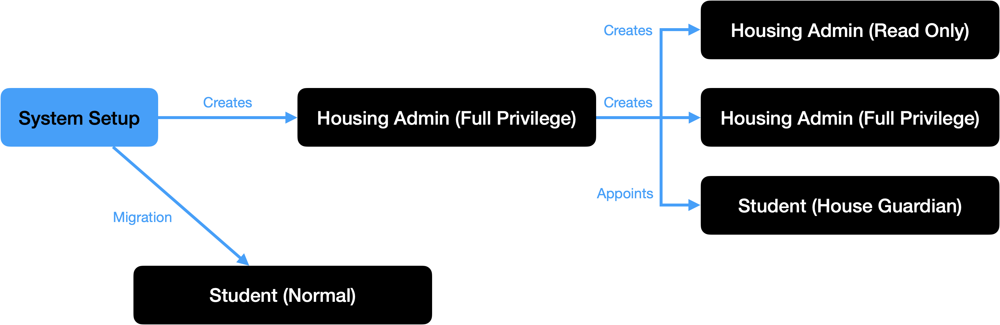

- Admin
  - Full privilege
    - Be able to read/write all information
    - Be able to import system data
    - Be able to create new Application Period
    - Be able to review/offer/reject housing applications
    - Be able to overwrite any user data
    - Be able to grant/revoke student's House-guardian privilege
    - Be able to check/create/update housing Events like a House Guardian
  - Read-only privilege
    - Be able to read all information only
- Student
  - Normal
    - Only see information relevant to self
    - Only be able to update non-sensitive personal information
    - Changing sensitive data (e.g. legal name, IC number, etc.) is NOT allowed.
  - House-guardian privilege
    - Be able to check partial student information on the floor managed by the user.
    - Be able to check/create/update housing Events.
    - Be able to log student attendance for Events.

> It is implemented via a `Access` class, view source code [here](https://github.com/MarkHershey/SUTDHousingPortal/blob/master/src/api/access_utils.py).

#### Frontend Implementation Challenges

- To design and implement UI components from scratch requires a tremendous amount of work. Therefore, we utilize some libraries such as [Ant Design](https://ant.design/), [Bootstrap](https://getbootstrap.com/), and [Material UI](https://material-ui.com/).
- Every HTTP request takes time to get a response. If we directly 'assume' that the data is ready and start to render it, it will result in page errors. Therefore, we decided to use empty placeholders to fill in all the required data fields first. Then, after the data is fetched, we use the `componentDidMount` function to replace all placeholders with real data.
- After the update of certain user profiles, it is good to see the change immediately after the update completes. However, updating the change is done by an async HTTP `POST` request while in order to get the updated value we need an async HTTP `GET` request. When writing code, if we just execute the `POST` followed by `GET`, it is possible that `POST` is done after the `GET`, resulting in failure of fetching the latest version of data. Our solution is that we start the `GET` only when we are sure that `POST` has completed by putting the `GET` function inside the `.then()` of the `POST` function(That means that the `POST` has returned normally). The experience has taught us: be aware of the async function!
- Another challenge is to preventing user accessing pages that it does not has access to. Admin and students have their unique frontend interfaces, which shouldn't be reached by the other type of user. We do try to avoid this by designing 2 different navigation bars. However, instead of using the navigation bar, how about the student just key in the URL? Therefore we designed a router guard (which is different from our login router guard), if the type of the user is forbidden, it will redirect the URL to the home page.

### Testing Challenges

#### Auto-computation of Test Coverage

How do we develop and push new features with confidence? We believe test-driven development with continuous integration is the solution. How do we know that our program is fully tested? We believe auto-computation of test coverage is essential.

In our project, we adopted the testing framework [pytest](https://docs.pytest.org/) to run python unit tests based on Python's built-in [unittest](https://docs.python.org/3/library/unittest.html) module. We also adopted the test coverage computation and reporting tool [Codecov](https://about.codecov.io/) to auto-compute statement coverage for us. Furthermore, we set up a continuous integration (CI) pipeline on [GitHub Actions](https://github.com/MarkHershey/SUTDHousingPortal/actions) to run all of our tests and compute test coverage automatically every time we push new commits to GitHub, or every time before a pull request get approved. By using web interface provided by [Codecov](https://app.codecov.io/gh/MarkHershey/SUTDHousingPortal), we could easily checkout testing statistics report and locate under-tested source code lines.

#### UI Testing Challenges

As some of our components are rendered dynamically and are not statically rendered, we found that we had to find a way to give the components being rendered a unique id so that we are able to control the component when utilizing selenium. In order to solve this issue, we decide to allocate the component’s id based on the data we data of other fields in the state. This allows us to have a unique id for the component and a way for us to know the id of the component in selenium as we control what data is filled up in the other previous fields and thus we would have the unique id of the component we want.

## Testing

> Checkout testing-related source code [here](https://github.com/MarkHershey/SUTDHousingPortal/tree/master/tests)

#### a. Unit Test

Unit tests are the basic white-box tests to ensure functional behaviors matches with the defined project requirements and be able to produces expected output consistently. We achieve **90+ percent** statement coverage on testable backend code.

- Unit Test Coverage Report: [app.codecov.io/gh/MarkHershey/SUTDHousingPortal](https://app.codecov.io/gh/MarkHershey/SUTDHousingPortal)

#### b. Integration Test

Our integration tests serve as the black-box test after the backend has beed deployed. The objective of integration tests is mainly testing the integration of our backend server and the cloud database server. We use Python's `requests` library to make API calls (HTTP requests) to our backend server, and then we verify the expected result directly from MongoDB database. This is to ensure 1. backend produces expected results. 2. the data models (classes) we defined in backend code can be correctly converted to database collections and vice versa.

#### c. API-level User Flow Test

API-level user flow test uses API endpoints to simulate user behaviors, it models the complete user journey from start to end. the user flow covers:

1. create admin user accounts
2. create student user accounts and profiles
3. assign students as house guardians
4. house guardians create housing events
5. students sign up for events
6. house guardians take attendance for events
7. admins issue disciplinary records to students
8. admins migrate room data
9. admins create housing application exercise period
10. students submit new housing applications
11. admins approve/ reject / wait-list applications
12. students accepts/ decline housing offers

#### d. UI-level User Flow Test with Selenium

UI-level user flow tests cover the same user flow as above, but it is done at the user interface level, thus completely black-boxed, the test program has no direct access to API endpoints, it could only access what normal user could possibly access. The automated test is powered by Selenium with Python.

#### e. UI Robustness Tests with Selenium

To ensure that the robustness of our system, the application should not stop responding, the database should not be taking in invalid or malicious data under any circumstances. Thus, we introduced the money test, which is powered by Selenium to randomly click buttons, create random inputs.

#### f. User Test with End User

To continuous get feedback from our end user, we have approached to many fellow students and invited them to try our application, asking for their suggestion along the way we develop and roll out new features. Their positive feedback had affirmed us that we are going at the right direction, and some criticism also helped us to iterate and refine features.

Feedbacks from end user:

> How satisfied are you with the new event management system?
>
> 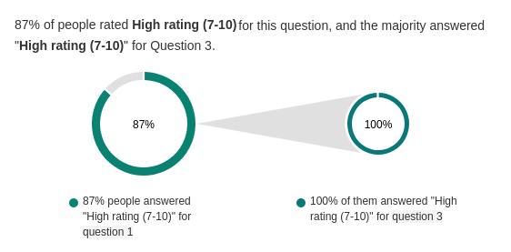

> How useful it is for Housing Portal to integrate the Housing Event system?
>
> 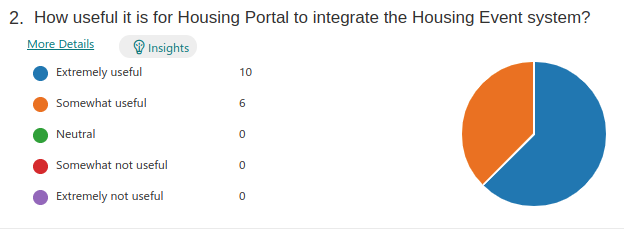

> Do you think our process of Event creation/sign-up/record attendance on the web interface is intuitive and user-friendly?
>
> 1: Not Intuitive; 10: Very intuitive
>
> 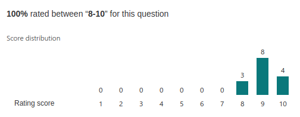

> Other feedbacks:
>
> 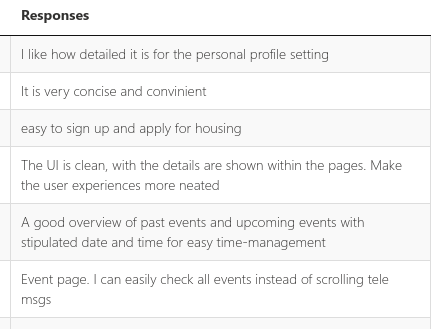

## Lesson Learned

We used the iterative and incremental methods. At first, our frontend and backend were developed separately. For the frontend part, it was initially a static webpage. Later on, we started to make the real functional frontend and backend. We discussed the next stage’s work together. Usually, the backend will be developed at one stage faster than the frontend to ensure that the frontend will not need to wait for the backend to implement required functions which could be a waste of time. After each stage is finished, corresponding tests are written for both the backend and frontend to ensure the stability of the functions.

One of the challenges we faced was work allocation. To implement each function, both frontend and backend require a different amount of work for different components.

For example, for our event component, the required work for the backend was relatively little. However, in order to implement different functions, like create an event, edit an event, delete an event, view all events, etc in the frontend, different component types like modal, dynamic list, notification, DateTime selector are required, which was hard to arrange both the layout and the functions behind them properly. So it is hard to make frontend and backend development progress at the same pace.

Therefore, we learned that an estimate of workload for different sub-systems before the start of development is very important when we use the iterative and incremental method.

We need to plan the development timeline based on many factors: our role (backend or frontend), the amount of work, and priorities. It is only when we consider all of them appropriately we can wrap up our work in time and with high quality.

## Deliverables

- Project Git Repository: [github.com/MarkHershey/SUTDHousingPortal](https://github.com/MarkHershey/SUTDHousingPortal)
- Live Application: [esc.dev.markhh.com](http://esc.dev.markhh.com/)
- API Documentation: [esc.dev.markhh.com/api/docs](http://esc.dev.markhh.com/api/docs)
- Test Coverage Report: [app.codecov.io/gh/MarkHershey/SUTDHousingPortal](https://app.codecov.io/gh/MarkHershey/SUTDHousingPortal)

### Application Screenshots

|   User   |         Page         |                        Screenshot                         |
| :------: | :------------------: | :-------------------------------------------------------: |
| Everyone |     Portal Login     |    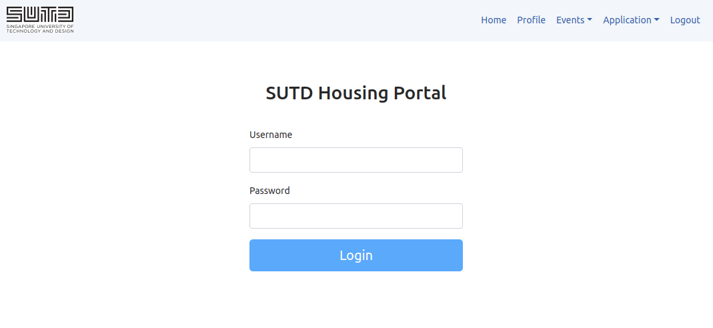    |
| Student  |      User Home       |         |
| Student  |    Housing Events    |   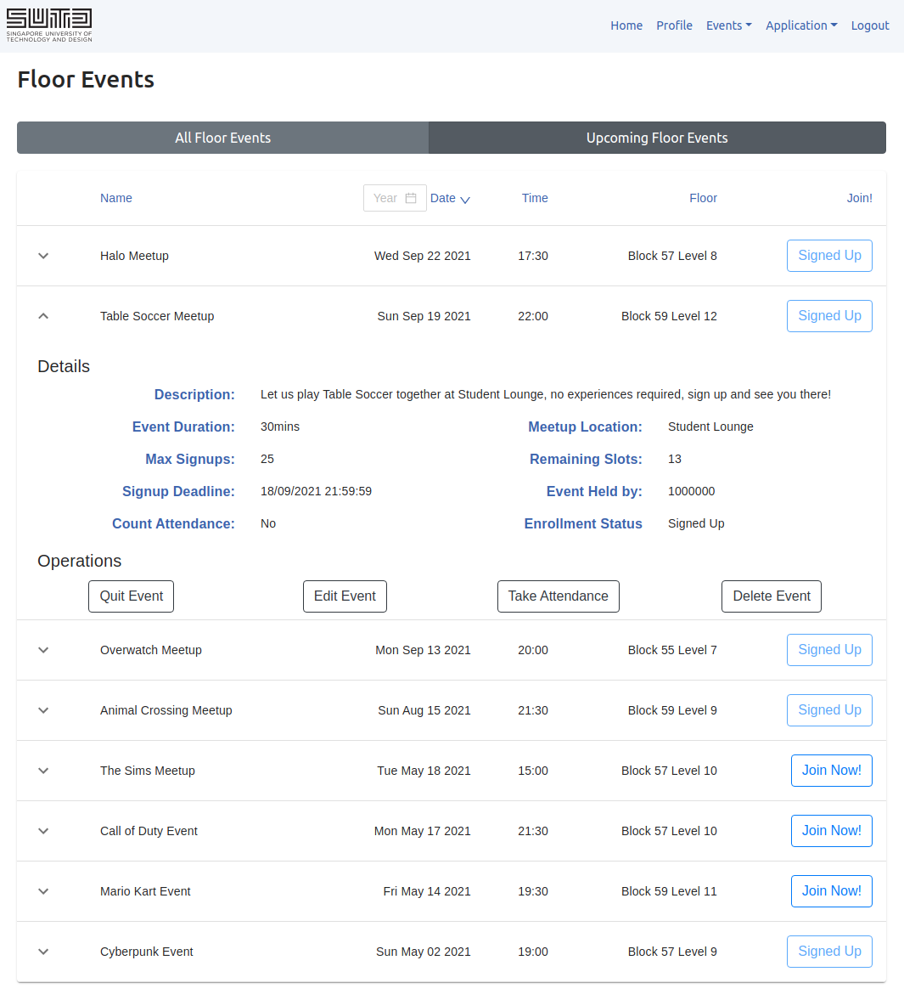    |
| Student  |   Track My Events    |  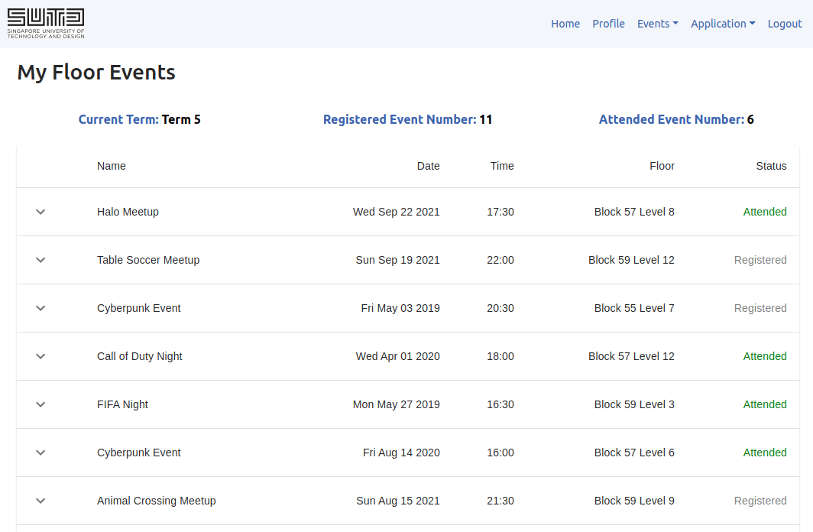  |
| Student  |  Submit Application  |     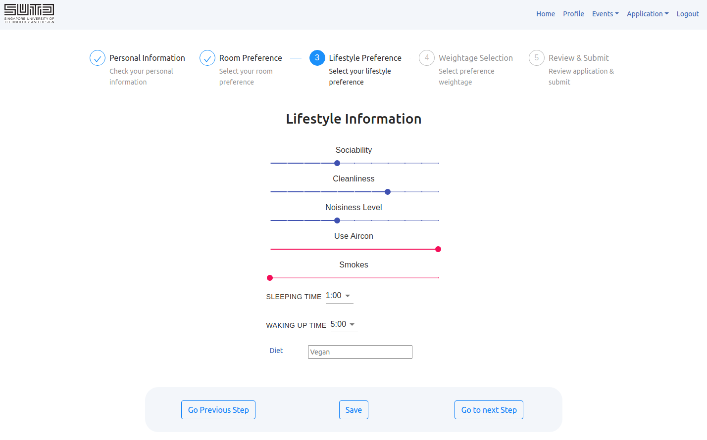     |
| Student  |  Submit Application  |     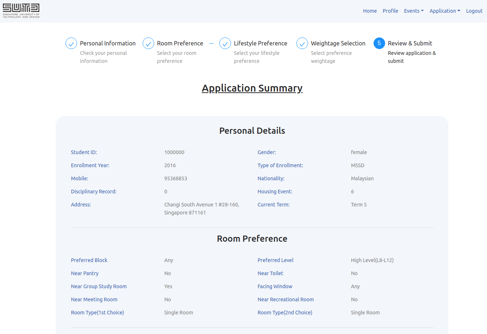     |
| Student  |  Application Status  |     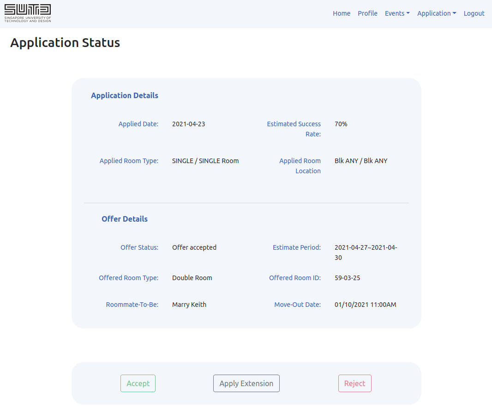     |
|  Admin   | Application Periods  |     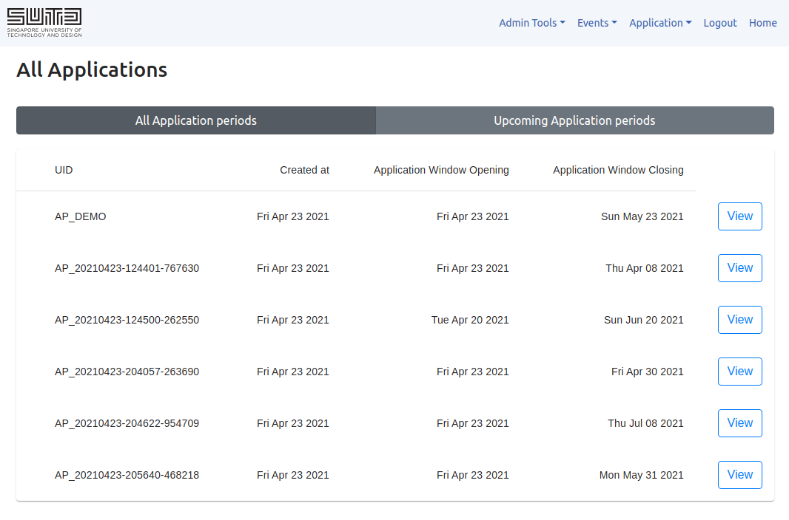     |
|  Admin   | Review Applications  |     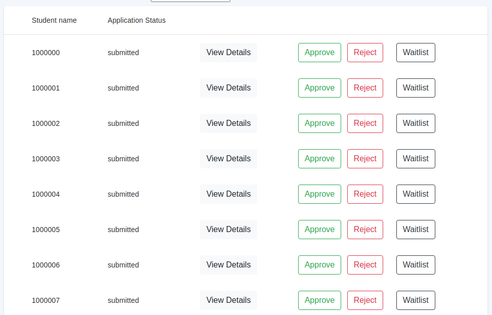     |
|  Admin   | Disciplinary Records |     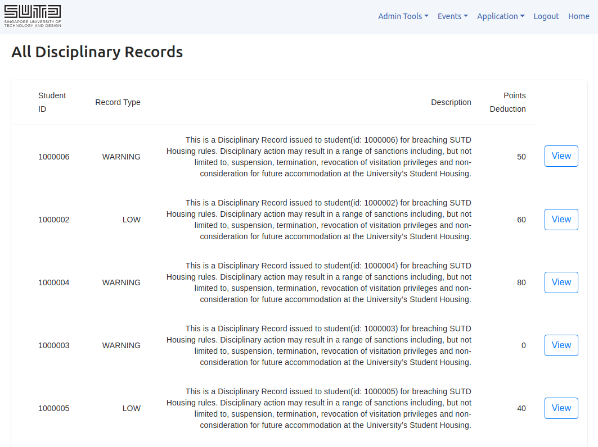      |
|  Admin   |     Admin Tools      | 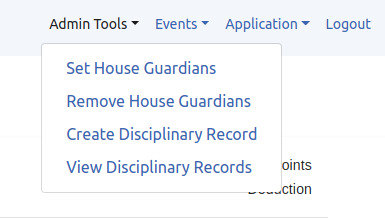 |

### API Endpoints

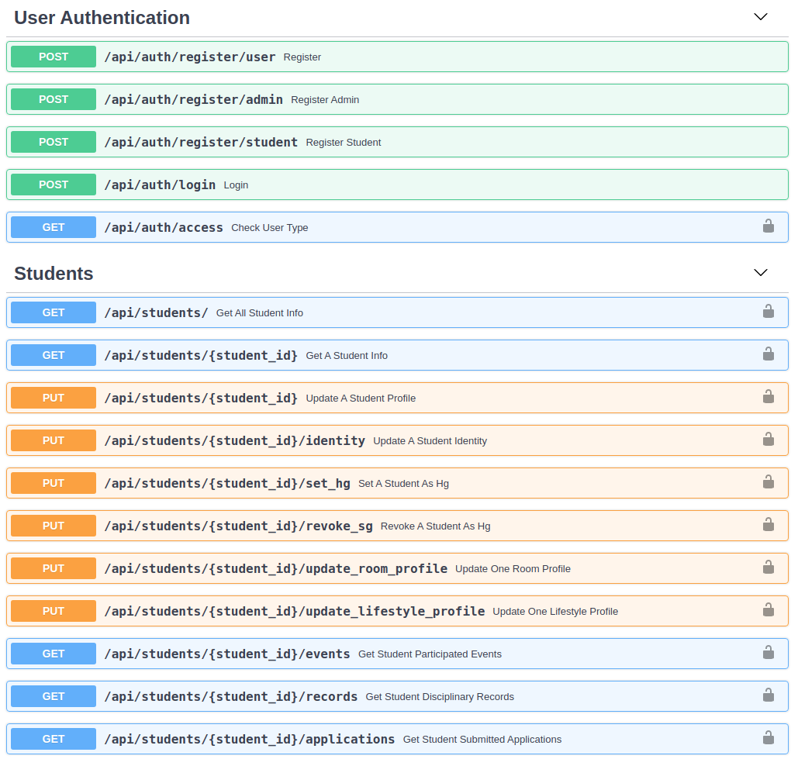
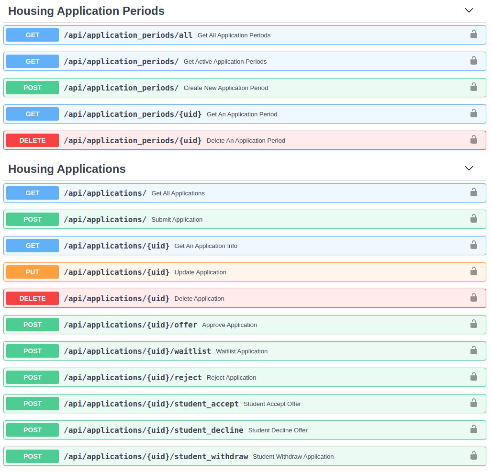
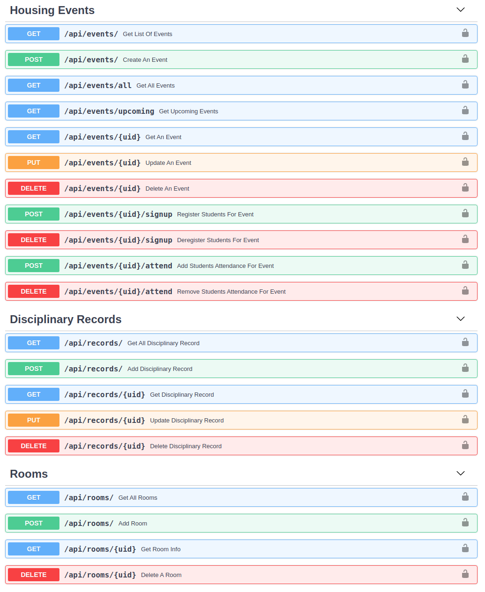
