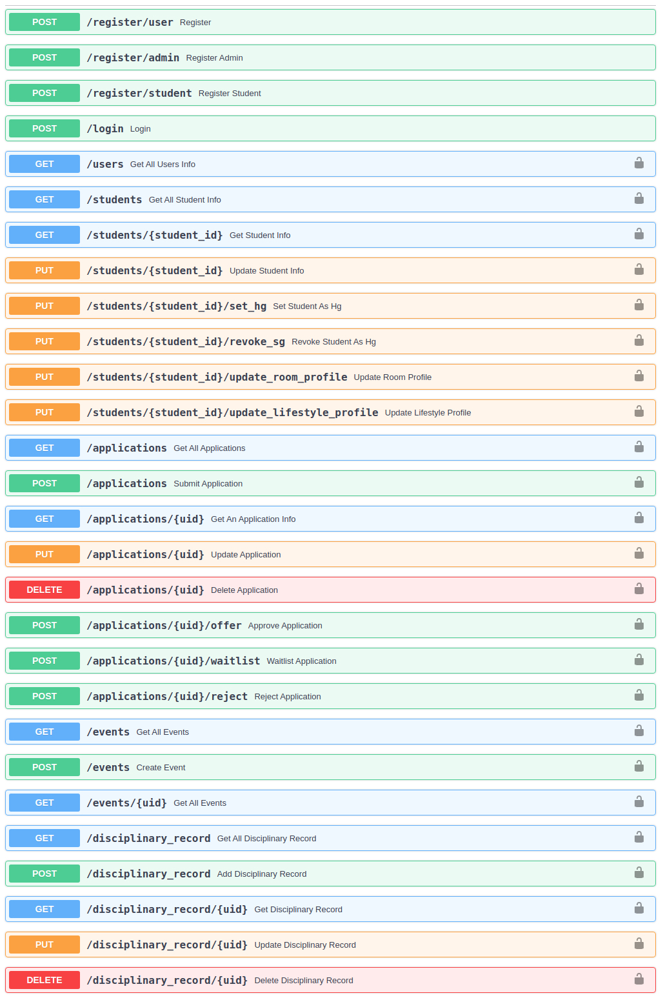
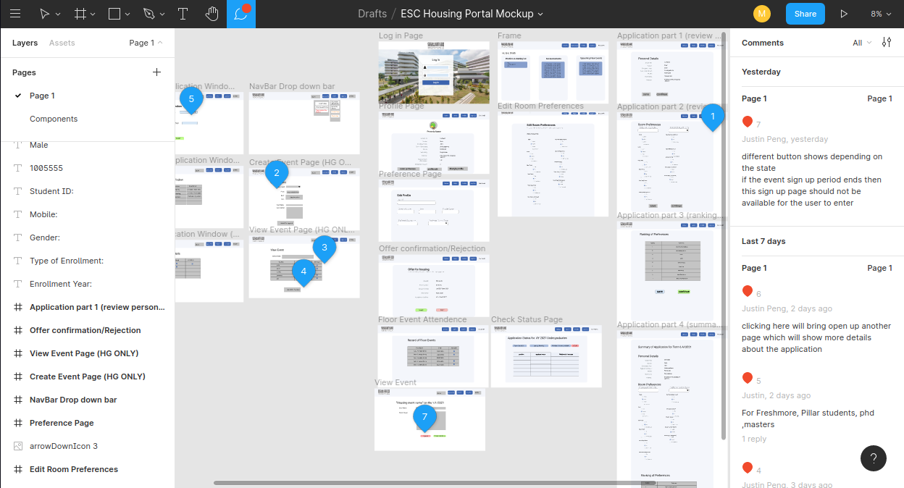
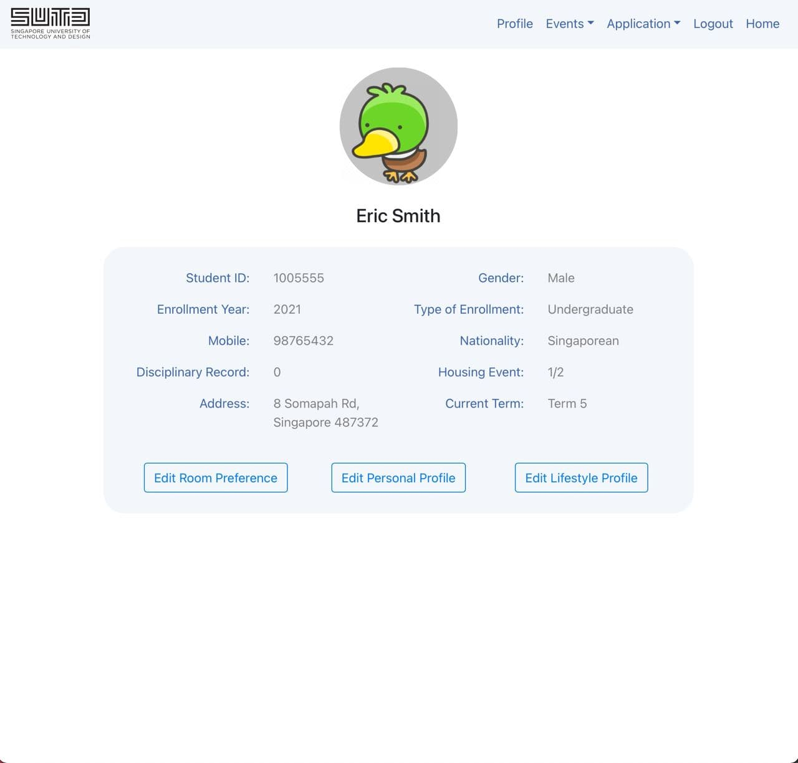
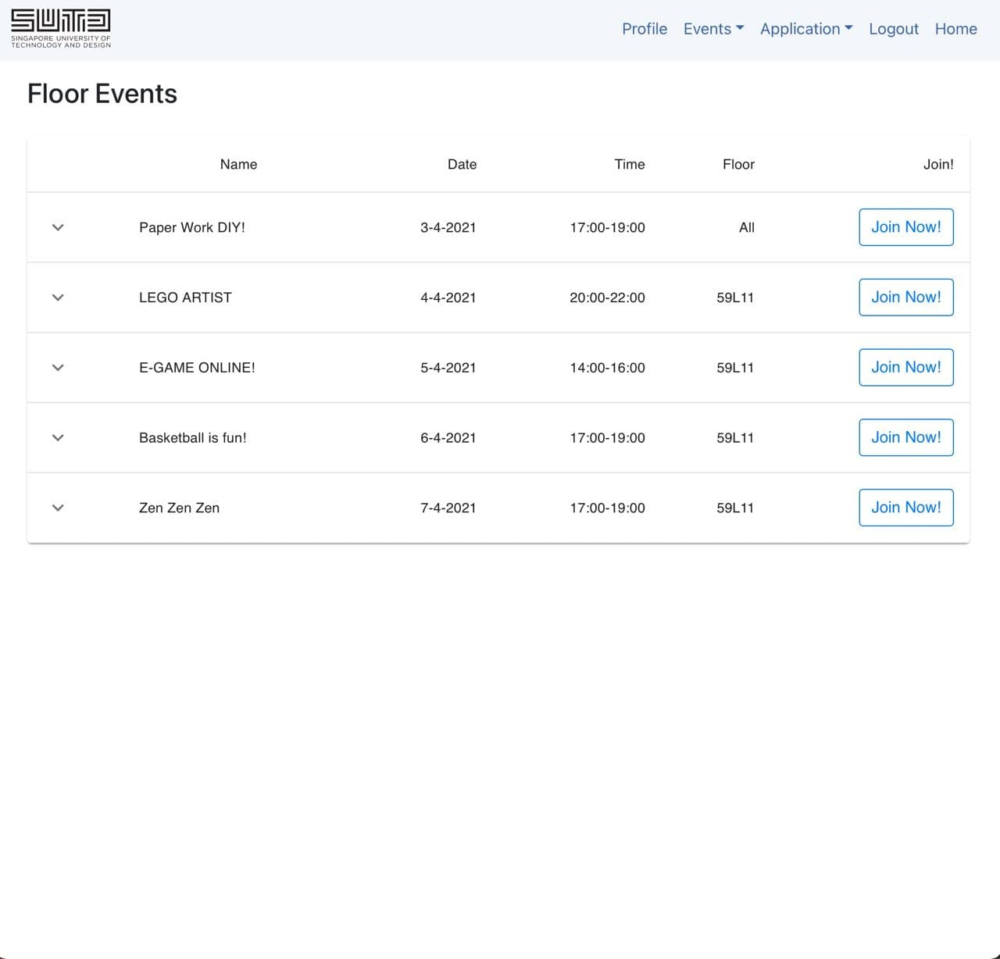
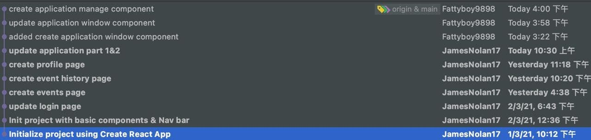
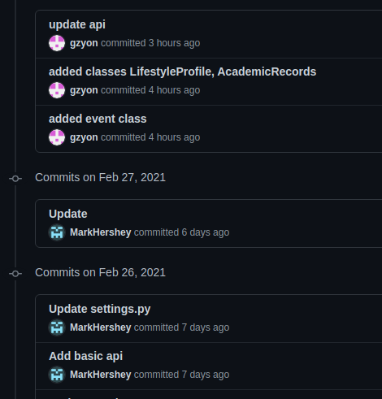

# 50.003 Elements of Software Construction - Project Meeting 2

ISTD Cohort 1 Group 9 - Self-initiated Project: new SUTD Housing Portal

-   Huang He (1004561)
-   Justin Peng (1004234)
-   Ong Zhi Yi (1004664)
-   Wang Chenyu (1004515)

## Refinement of Project Scope

After extensive discussion done with Housing Staff, Office of Student Life, and some House Guardians, we have understand that their currently pain point is related to housing event scheduling, registration, and attendance tracking. Since housing event attendance is a major criteria in the housing application process, facilitate this process will also boost the efficiency of all parties involved. Hence, we have prioritized the features to support Housing event creation, registration, and attendance tracking. In addition, we need to take care of the new role "House Guardian" as a special type of student who can create events and see relevant resident information partially. We have since introduced a rough access control plan as follows:

-   Housing Admin
    -   Full privilege
        -   Be able to read/write all information
        -   Be able to import system data
        -   Be able to create new Application Period
        -   Be able to review/offer/reject housing applications
        -   Be able to overwrite any user data
        -   Be able to grant/revoke student's House-guardian privilege
        -   Be able to check/create/update housing Events like a House Guardian
    -   Read-only privilege
        -   Be able to read all information only
-   Student
    -   Normal
        -   Only see information relevant to self
        -   Only be able to update non-sensitive personal information
        -   Changing sensitive data (e.g. legal name, IC number, etc.) is NOT allowed.
    -   House-guardian privilege
        -   Be able to check partial student information on the floor managed by the user.
        -   Be able to check/create/update housing Events.
        -   Be able to log student attendance for Events.

## UML Use Case Diagram

## UML Sequence Diagram

Key Sequence: student submit housing application

Key Sequence: JWT Authentication implementation

## UML Class Diagram

## Backend API Design

-   This is currently designed API endpoints only, yet to complete.

## Frontend Design & Current progress

-   We have done a User Interface Design Mockup in Figma, this serves a visual aid for our app development such that everyone in the team can understand the features and user journey unambiguously.

-   Some progress on Frontend development

## Testing Plan

-   Unit Test
    -   function-level white box testing
    -   Tools
        -   [pytest](https://docs.pytest.org/en/stable/) framework
        -   Python's [unittest](https://docs.python.org/3/library/unittest.html) package
-   Integration Test
    -   API-level testing
    -   UI level testing
    -   docker deployment testing
    -   Tools
        -   [pytest](https://docs.pytest.org/en/stable/), and Python's [subprocess](https://docs.python.org/3/library/subprocess.html)
        -   [selenium](https://selenium-python.readthedocs.io/)
-   Non-functional Test
    -   Stress Testing
    -   Load Testing
    -   Performance Testing
    -   Tools
        -   [Gatling](https://gatling.io/)
        -   Python

## Commit History

At the early stage of development, we have experimented with different web frameworks, so the early works are fragmented at several different repositories.

Current Merged Project Repository: [https://github.com/MarkHershey/SUTDHousingPortal](https://github.com/MarkHershey/SUTDHousingPortal)
